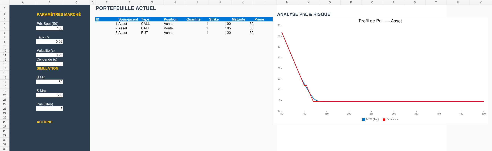
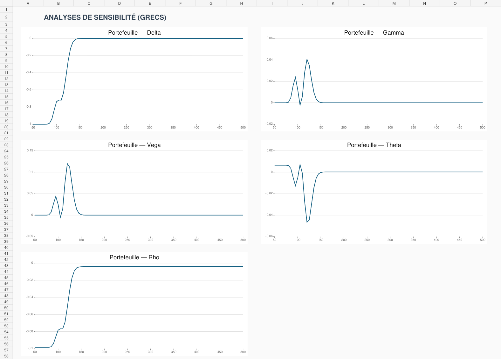

# Pricer d’options vanilles et Grecs — Excel VBA

Application Excel/VBA de valorisation et d’analyse d’un portefeuille
mono-sous-jacent d’options européennes avec le modèle de Black–Scholes.

> **Installation nécessaire :** `Projet_VBA_BS.xlsm` est le classeur modèle
> sain. Pour obtenir la version corrigée, téléchargez tout le dépôt puis
> double-cliquez sur `Installer-Corrections.cmd`. Le fichier généré à utiliser
> est `Projet_VBA_BS_corrige.xlsm`.





## Fonctionnalités

- valorisation des Calls et Puts européens ;
- prise en compte d’un rendement de dividende continu ;
- positions acheteuses et vendeuses ;
- calcul du Delta, Gamma, Vega, Theta et Rho ;
- profil de PnL mark-to-market et à l’échéance ;
- formulaire VBA pour ajouter et supprimer des positions ;
- contrôles de validité des paramètres et des positions ;
- graphiques automatiques du PnL et des Grecs ;
- tests numériques de non-régression.

## Hypothèses du modèle

Le modèle suppose :

- un seul sous-jacent par portefeuille ;
- une maturité commune pour construire un PnL à l’échéance cohérent ;
- des options européennes ;
- un taux sans risque, une volatilité et un rendement de dividende constants ;
- des montants exprimés par unité d’option, sans multiplicateur de contrat ;
- l’absence de coûts de transaction.

Les paramètres de taux et de volatilité sont saisis sous forme décimale :
`0,25` correspond à `25 %`.

## Utilisation

1. Téléchargez le dépôt complet avec **Code > Download ZIP**, puis extrayez-le.
2. Fermez Excel.
3. Dans Excel, activez temporairement **Accès approuvé au modèle d’objet du
   projet VBA** dans les paramètres du Centre de gestion de la confidentialité.
4. Double-cliquez sur `Installer-Corrections.cmd`.
5. Ouvrez le nouveau fichier `Projet_VBA_BS_corrige.xlsm`.
6. Désactivez de nouveau l’accès approuvé au projet VBA.
7. Autorisez les macros uniquement si le dépôt téléchargé est bien celui-ci.
8. Renseignez les hypothèses puis utilisez **Ouvrir Portfolio** et
   **Calculer & Tracer**.

Une prime vide est automatiquement remplacée par la prime théorique
Black–Scholes. Une prime égale à zéro est conservée comme une valeur explicite.

### En cas de blocage

- Supprimez toute copie téléchargée avant la version `1.1.1`, puis
  retéléchargez le dépôt.
- Si Windows bloque les macros provenant d’Internet, faites un clic droit sur
  le ZIP téléchargé, ouvrez **Propriétés**, cochez **Débloquer**, puis
  extrayez-le de nouveau.
- Si l’installateur indique qu’Excel bloque le projet VBA, activez
  temporairement l’accès approuvé décrit à l’étape 3, relancez l’installation,
  puis désactivez ce réglage.

## Unités des Grecs

| Mesure | Unité affichée |
|---|---|
| Delta | variation pour une unité de sous-jacent |
| Gamma | variation du Delta pour une unité de sous-jacent |
| Vega | variation pour +1 point de volatilité |
| Theta | variation par jour calendaire |
| Rho | variation pour +1 point de taux |

## Structure du dépôt

```text
.
├── Projet_VBA_BS.xlsm
├── Installer-Corrections.cmd
├── src/
│   ├── Classe1.cls
│   ├── DesignModule.bas
│   ├── Portfolio.bas
│   ├── frmPortfolio.frm
│   └── frmPortfolio.frx
├── scripts/
│   ├── Export-VbaSources.ps1
│   └── Sync-VbaProject.ps1
├── tests/
└── docs/
```

Le fichier `Projet_VBA_BS.xlsm` est conservé comme modèle Excel sain. Les
sources corrigées se trouvent dans `src`, en UTF-8 et comparables dans Git.
L’installateur demande à Microsoft Excel d’importer ces sources puis crée
`Projet_VBA_BS_corrige.xlsm`. Cette méthode évite de réécrire directement le
format binaire interne du projet VBA.

## Synchroniser les sources avec le classeur

Après une modification des fichiers dans `src`, ouvrez PowerShell à la racine
du dépôt et exécutez :

```powershell
powershell -ExecutionPolicy Bypass -File .\scripts\Sync-VbaProject.ps1
```

Le script conserve le modèle intact, importe les modules avec Microsoft Excel,
applique les validations, recalcule la grille puis crée
`Projet_VBA_BS_corrige.xlsm`. Si ce fichier existe déjà, il est d’abord
sauvegardé avec un horodatage.

Excel doit autoriser temporairement l’option :
**Accès approuvé au modèle d’objet du projet VBA**. Désactivez-la après la
synchronisation.

Pour exporter le projet VBA du classeur vers des fichiers UTF-8 :

```powershell
powershell -ExecutionPolicy Bypass -File .\scripts\Export-VbaSources.ps1
```

## Tests

Les tests utilisent uniquement la bibliothèque standard de Python :

```bash
python -m unittest discover -s tests -v
```

Ils contrôlent notamment :

- la parité Call–Put avec dividende ;
- le Delta et le Gamma par différences finies ;
- les valeurs de référence du portefeuille exemple ;
- la réinitialisation des totaux à chaque valeur du spot ;
- la conversion systématique des maturités en jours ;
- la suppression sécurisée des positions.

## Limites et extensions possibles

Le projet ne traite pas encore :

- les options américaines ;
- les smiles et surfaces de volatilité ;
- les portefeuilles multi-actifs ;
- les courbes de taux par maturité ;
- les multiplicateurs de contrat et frais de transaction ;
- les scénarios dynamiques dans le temps.

Ce logiciel est un projet pédagogique. Il ne constitue pas un conseil
financier ni un système de valorisation destiné à la production.
